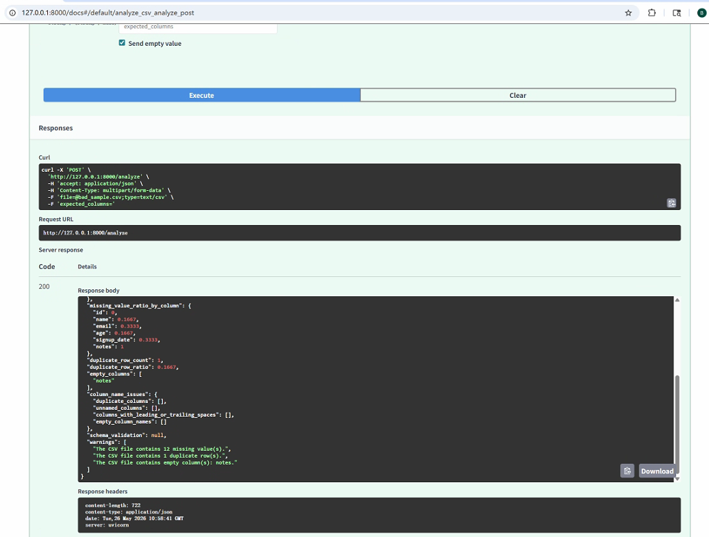
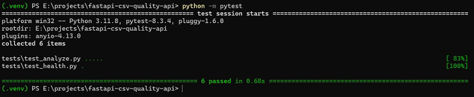
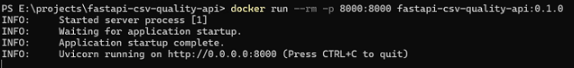

# FastAPI CSV Quality API

A minimal FastAPI service that accepts CSV uploads and returns a structured JSON data quality report.

## Why this project

CSV files are still common in analytics, operations, and internal business workflows. Before a CSV file is used in a pipeline, it is useful to run simple quality checks such as missing values, duplicate rows, empty columns, and schema mismatch checks.

This API demonstrates a complete but lightweight backend workflow:

- upload a CSV file
- validate basic file constraints
- analyze the CSV with pandas
- return a typed JSON response with Pydantic models
- test the API with pytest
- package the service with Docker

## Features

The `POST /analyze` endpoint returns:

- `row_count`
- `column_count`
- `column_names`
- `missing_values_by_column`
- `missing_value_ratio_by_column`
- `duplicate_row_count`
- `duplicate_row_ratio`
- `empty_columns`
- `column_name_issues`
- optional `schema_validation`
- `warnings`

The API also includes structured errors for:

- non-CSV files
- empty uploads
- parse errors
- unsupported encodings
- files larger than 5 MB

## Tech stack

- Python 3.12
- FastAPI
- Pydantic
- pandas
- pytest
- Uvicorn
- Docker

## Project structure

```text
fastapi-csv-quality-api/
├── README.md
├── LICENSE
├── requirements.txt
├── Dockerfile
├── docker-compose.yml
├── .gitignore
├── app/
│   ├── __init__.py
│   ├── main.py
│   ├── models.py
│   ├── analyzer.py
│   └── errors.py
├── tests/
│   ├── __init__.py
│   ├── test_health.py
│   ├── test_analyze.py
│   └── fixtures/
├── sample_data/
├── screenshots/
├── docs/
└── article_assets/
```

## Quick start

### Windows 11 / PowerShell

```powershell
python -m venv .venv
.\.venv\Scripts\Activate.ps1
python -m pip install --upgrade pip
pip install -r requirements.txt
uvicorn app.main:app --reload
```

If PowerShell blocks virtual environment activation, run:

```powershell
Set-ExecutionPolicy -ExecutionPolicy RemoteSigned -Scope CurrentUser
```

Then activate again:

```powershell
.\.venv\Scripts\Activate.ps1
```

### macOS / Linux / Git Bash

```bash
python -m venv .venv
source .venv/bin/activate
python -m pip install --upgrade pip
pip install -r requirements.txt
uvicorn app.main:app --reload
```

Open Swagger UI:

```text
http://127.0.0.1:8000/docs
```

## API usage

### Health check

```bash
curl http://127.0.0.1:8000/health
```

Expected response:

```json
{
  "status": "ok",
  "service": "fastapi-csv-quality-api",
  "version": "0.1.0"
}
```

### Analyze a good CSV

PowerShell:

```powershell
curl.exe -X POST "http://127.0.0.1:8000/analyze" `
  -F "file=@sample_data/good_sample.csv"
```

bash:

```bash
curl -X POST "http://127.0.0.1:8000/analyze" \
  -F "file=@sample_data/good_sample.csv"
```

### Analyze a bad CSV

PowerShell:

```powershell
curl.exe -X POST "http://127.0.0.1:8000/analyze" `
  -F "file=@sample_data/bad_sample.csv"
```

bash:

```bash
curl -X POST "http://127.0.0.1:8000/analyze" \
  -F "file=@sample_data/bad_sample.csv"
```

### Analyze with expected columns

PowerShell:

```powershell
curl.exe -X POST "http://127.0.0.1:8000/analyze" `
  -F "file=@sample_data/good_sample.csv" `
  -F "expected_columns=id,name,email,age,signup_date"
```

bash:

```bash
curl -X POST "http://127.0.0.1:8000/analyze" \
  -F "file=@sample_data/good_sample.csv" \
  -F "expected_columns=id,name,email,age,signup_date"
```

## Example response

```json
{
  "filename": "bad_sample.csv",
  "row_count": 6,
  "column_count": 6,
  "column_names": [
    "id",
    "name",
    "email",
    "age",
    "signup_date",
    "notes"
  ],
  "missing_values_by_column": {
    "id": 0,
    "name": 1,
    "email": 2,
    "age": 1,
    "signup_date": 2,
    "notes": 6
  },
  "missing_value_ratio_by_column": {
    "id": 0.0,
    "name": 0.1667,
    "email": 0.3333,
    "age": 0.1667,
    "signup_date": 0.3333,
    "notes": 1.0
  },
  "duplicate_row_count": 1,
  "duplicate_row_ratio": 0.1667,
  "empty_columns": [
    "notes"
  ],
  "column_name_issues": {
    "duplicate_columns": [],
    "unnamed_columns": [],
    "columns_with_leading_or_trailing_spaces": [],
    "empty_column_names": []
  },
  "schema_validation": null,
  "warnings": [
    "The CSV file contains 12 missing value(s).",
    "The CSV file contains 1 duplicate row(s).",
    "The CSV file contains empty column(s): notes."
  ]
}
```

## Structured error example

```json
{
  "error": {
    "code": "invalid_file_type",
    "message": "Only .csv files are supported.",
    "details": {
      "filename": "not_csv.txt"
    }
  }
}
```

## Tests

Run:

```bash
pytest
```

The minimum test suite covers:

- `/health` returns 200
- normal CSV analysis
- missing value detection
- duplicate row detection
- non-CSV error handling
- expected column schema validation

## Docker usage

### Build the image

```bash
docker build -t fastapi-csv-quality-api .
```

### Run the container

```bash
docker run --rm -p 8000:8000 fastapi-csv-quality-api
```

Open:

```text
http://127.0.0.1:8000/docs
```

The container listens on `0.0.0.0:8000`. Your local machine accesses it through `127.0.0.1:8000` after port mapping.

### Docker Compose

```bash
docker compose up --build
```

Stop:

```bash
docker compose down
```

## Common Windows 11 notes

### Use `curl.exe` in PowerShell

In Windows PowerShell, use `curl.exe` for multipart upload examples. Some PowerShell environments treat `curl` as an alias.

### Port 8000 is already in use

Run:

```powershell
docker ps
```

Stop the container using the port:

```powershell
docker stop <container_id>
```

Or map to a different local port:

```powershell
docker run --rm -p 8001:8000 fastapi-csv-quality-api
```

Then open:

```text
http://127.0.0.1:8001/docs
```

## Screenshots

### Swagger UI


### CSV quality report



### Expected columns validation


### Tests passed



### Docker run



## Roadmap

This MVP intentionally avoids overengineering. Possible future improvements:

- configurable file size limit
- optional date format checks
- optional numeric column checks
- JSON schema export
- CI workflow with GitHub Actions
- deployment tutorial for a small cloud VM or Kubernetes platform

Not included in this MVP:

- authentication
- database storage
- frontend UI
- background jobs
- large-file streaming
- Kubernetes deployment
- production cloud infrastructure

## Article links

Add links here after publishing:

- Dev.to project note: TBD
- Civo tutorial idea: TBD
- Draft.dev writing sample: TBD

## License

MIT
