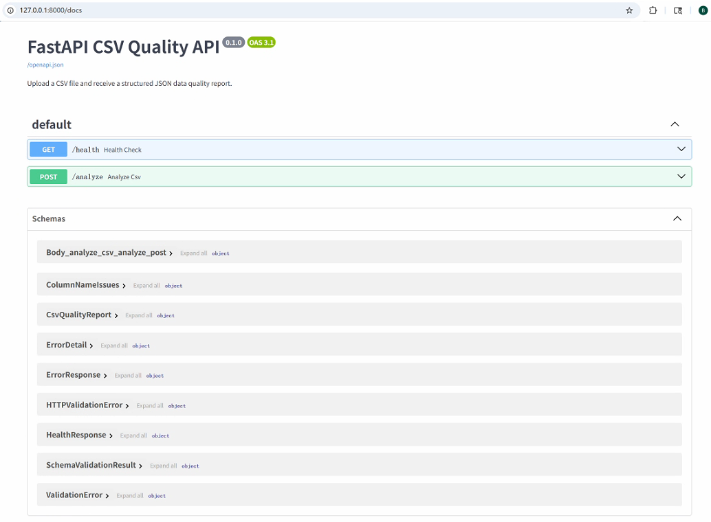
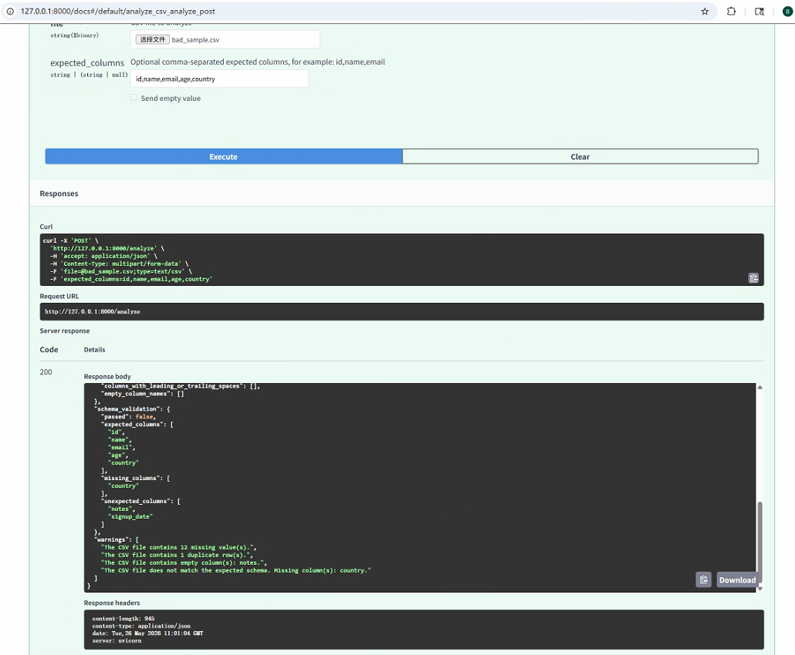

# Build a CSV Data Quality API With FastAPI and Pydantic

**Companion repository:** https://github.com/OnerGit/fastapi-csv-quality-api

*Draft.dev primary writing sample | Python, FastAPI, Pydantic, pandas, pytest*

> Scope note: Docker and cloud deployment are intentionally left out of this sample.

## Introduction

CSV files are still common in internal tools, operations workflows, analytics handoffs, and small data pipelines. Even when a team eventually stores data in a database or warehouse, CSV is often the format used for uploads, exports, and quick exchange between teams.

The problem is that many CSV checks still happen in one-off scripts. A developer writes a small Python script, runs it locally, prints a few numbers, and sends a result back to someone else. That works once, but it does not create a reusable interface.

In this tutorial, you will build a small FastAPI service that accepts a CSV upload and returns a structured JSON data quality report. The API checks row count, column count, column names, missing values, duplicate rows, empty columns, basic column name issues, and optional expected-column validation.

This project is intentionally scoped as a small developer tool. It is not a replacement for Great Expectations, dbt tests, or a full data quality platform. The goal is to turn a useful local check into a small API with a clear boundary, typed responses, structured errors, and tests.

## What you will build

By the end of this tutorial, you will have a FastAPI service with:

- `/health` endpoint for a quick service check
- `/analyze` endpoint for CSV uploads
- typed JSON quality reports using Pydantic models
- structured JSON error responses for invalid uploads
- pytest coverage for the API contract

## Prerequisites

You will need Python 3.12 or a recent Python 3 version, basic familiarity with FastAPI and pandas, and either curl, PowerShell, or FastAPI Swagger UI for manual testing.

```powershell
python -m venv .venv
.\.venv\Scripts\Activate.ps1
python -m pip install --upgrade pip
pip install -r requirements.txt
uvicorn app.main:app --reload
```

After the server starts, open the interactive API docs at `http://127.0.0.1:8000/docs`.



## Project overview

Code note: code blocks are simplified excerpts unless the text explicitly says they are full commands. Imports may be omitted where they are not central to the explanation.

The project separates HTTP routing, response models, analysis logic, and error handling. That separation keeps the route handler short and makes the analysis logic easier to test.

```text
fastapi-csv-quality-api/
├── app/
│   ├── main.py
│   ├── analyzer.py
│   ├── models.py
│   └── errors.py
├── tests/
├── sample_data/
├── docs/
└── README.md
```

The API boundary lives in `app/main.py`. The CSV parsing and quality checks live in `app/analyzer.py`. Pydantic response models live in `app/models.py`. Application-level error types and JSON error handling live in `app/errors.py`.

## Designing the quality report

Before writing the endpoint, it helps to define the response contract. A CSV quality report should be predictable enough for another script, frontend, or service to consume. The full models are available in the repository. In the full project, `ColumnNameIssues` and `SchemaValidationResult` are separate Pydantic models; the excerpt below shows the main response shape.

```python
class CsvQualityReport(BaseModel):
    filename: str
    row_count: int
    column_count: int
    column_names: list[str]
    missing_values_by_column: dict[str, int]
    missing_value_ratio_by_column: dict[str, float]
    duplicate_row_count: int
    duplicate_row_ratio: float
    empty_columns: list[str]
    column_name_issues: ColumnNameIssues
    schema_validation: SchemaValidationResult | None = None
    warnings: list[str]
```

This model does two jobs. First, it documents the API contract. Second, it prevents the API from becoming a loose collection of dictionaries.

## Creating the FastAPI app

The service only needs two endpoints for this version. The excerpt below omits imports and focuses on the API boundary: a health check and the CSV analysis endpoint.

```python
app = FastAPI(
    title="FastAPI CSV Quality API",
    description="Upload a CSV file and receive a structured JSON report.",
    version="0.1.0",
)

@app.get("/health", response_model=HealthResponse)
def health_check() -> HealthResponse:
    return HealthResponse(
        status="ok",
        service="fastapi-csv-quality-api",
        version="0.1.0",
    )
```

## Handling CSV uploads

The main endpoint accepts a multipart file upload. The excerpt below is simplified to keep the focus on the route shape. It also accepts an optional `expected_columns` form field.

```python
@app.post("/analyze", response_model=CsvQualityReport)
async def analyze_csv(
    file: Annotated[UploadFile, File(description="CSV file to analyze")],
    expected_columns: Annotated[str | None, Form()] = None,
) -> CsvQualityReport:
    return await analyze_csv_upload(
        file=file,
        expected_columns=expected_columns,
    )
```


You can test the endpoint from Windows PowerShell with `curl.exe`:

```powershell
curl.exe -X POST "http://127.0.0.1:8000/analyze" `
  -F "file=@sample_data/good_sample.csv"
```

The same endpoint can also receive expected columns:

```powershell
curl.exe -X POST "http://127.0.0.1:8000/analyze" `
  -F "file=@sample_data/good_sample.csv" `
  -F "expected_columns=id,name,email,age,signup_date"
```

## Implementing quality checks

The analyzer starts with basic file validation. The excerpt below is simplified and omits surrounding imports.

```python
MAX_FILE_SIZE_BYTES = 5 * 1024 * 1024

async def analyze_csv_upload(file: UploadFile, expected_columns: str | None = None):
    filename = file.filename or "uploaded.csv"

    if not filename.lower().endswith(".csv"):
        raise CsvQualityApiError(
            code="invalid_file_type",
            message="Only .csv files are supported.",
            status_code=400,
            details={"filename": filename},
        )

    content = await file.read()
    df = pd.read_csv(BytesIO(content))
```

After parsing, whitespace-only cells are normalized to missing values.

```python
df = df.replace(r"^\s*$", pd.NA, regex=True)

row_count = int(len(df))
column_names = [str(column) for column in df.columns]
column_count = int(len(column_names))

missing_values_by_column = {
    str(column): int(df[column].isna().sum())
    for column in df.columns
}

duplicate_row_count = int(df.duplicated().sum())
empty_columns = [
    str(column)
    for column in df.columns
    if bool(df[column].isna().all())
]
```

## Returning structured JSON

A useful API should return data that is easy to consume. The report includes both machine-readable fields and human-readable warnings.


```json
{
  "filename": "good_sample.csv",
  "row_count": 3,
  "column_count": 4,
  "duplicate_row_count": 0,
  "empty_columns": [],
  "schema_validation": null,
  "warnings": [
    "No basic data quality issues detected."
  ]
}
```

## Handling invalid files

The API should also fail in a predictable way. Instead of returning arbitrary exception text, the service uses an application-level error object and converts it into a FastAPI JSON response.

```python
class CsvQualityApiError(Exception):
    def __init__(
        self,
        code: str,
        message: str,
        status_code: int = 400,
        details: dict | None = None,
    ) -> None:
        self.code = code
        self.message = message
        self.status_code = status_code
        self.details = details or {}
```



For invalid uploads such as a non-CSV file, the API returns a structured error instead of a raw stack trace:

```json
{
  "error": {
    "code": "invalid_file_type",
    "message": "Only .csv files are supported.",
    "details": {
      "filename": "not_csv.txt"
    }
  }
}
```

## Testing the API

Even a small developer tool should have tests. The most important thing to test is the API contract: status codes, response fields, warning behavior, and structured error codes.

```python
def test_analyze_rejects_non_csv_file():
    with (FIXTURES_DIR / "not_csv.txt").open("rb") as file_obj:
        response = client.post(
            "/analyze",
            files={"file": ("not_csv.txt", file_obj, "text/plain")},
        )

    assert response.status_code == 400
    assert response.json()["error"]["code"] == "invalid_file_type"
```


## What to improve next

The current version intentionally avoids production features. It does not include authentication, database storage, a frontend UI, background jobs, large-file streaming, or production cloud infrastructure. The upload limit is intentionally small.

Possible next improvements include configurable file size limits, date format checks, numeric range checks, JSON schema export, CI, and containerization for repeatable local runs. For this writing sample, containerization is treated as a future extension rather than the main topic.

## Conclusion

A CSV data quality check can start as a short Python script, but turning it into an API changes how other developers can use it. FastAPI provides the HTTP boundary. Pydantic defines the response contract. pandas handles the CSV analysis. Structured errors make failures predictable. pytest protects the expected behavior.

The result is not a large platform, and it should not be described as one. It is a small developer tool with a clean boundary, useful defaults, and enough structure to be extended later.
